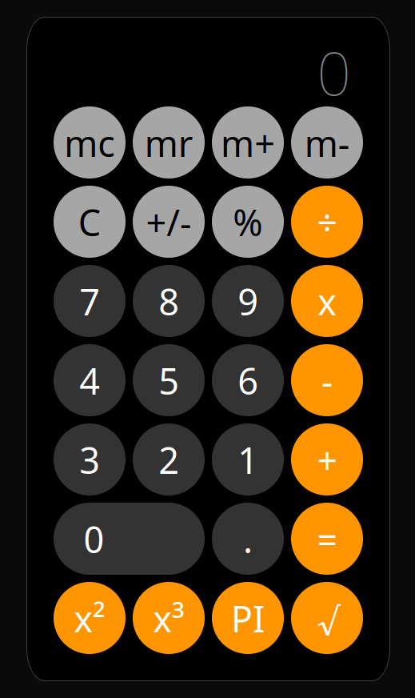

# iPhone Web Calculator App

This is a simple web calculator application designed to mimic the appearance and functionality of a calculator on an iPhone. It's built using HTML, CSS, and JavaScript and includes memory functions for basic calculations.

## Features

- **Basic Arithmetic Operations:** Addition, subtraction, multiplication, and division.
- **Memory Functions:** Store and recall values using memory buttons (M+, M-, MR, MC).screen sizes.
- **Simple Interface:** Resembles the iPhone calculator for intuitive use.

## Technologies Used

- **HTML:** Provides the structure and layout of the calculator app.
- **CSS:** Styles the elements for a visually appealing and responsive design.
- **JavaScript:** Implements the calculator's logic and functionality.

## Usage

To use the calculator:

1. Clone or download the repository.
2. Open the `index.html` file in your web browser.
3. Perform calculations using the provided buttons.
4. Use the memory buttons (M+, M-, MR, MC) to store and recall values as needed.

## How It Works

The HTML file (`index.html`) contains the structure of the calculator, defining buttons and display elements.

CSS styles (`style.css`) are applied to create the iPhone-like appearance and ensure responsiveness on different devices.

JavaScript logic (`script.js`) handles the calculations, memory operations, and interaction between the buttons and display.

## Preview

<!-- _Insert an image or GIF showing the calculator app in action_ -->

<!-- ## Demo

_Insert a link to a live demo of the calculator (if available)_ -->

## Contribution

If you'd like to contribute to this project:

1. Fork the repository.
2. Make your changes.
3. Submit a pull request detailing your modifications.
